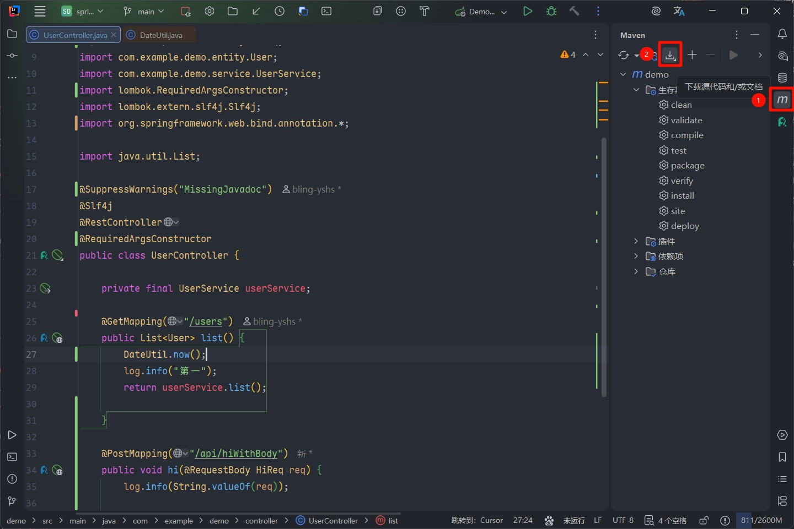
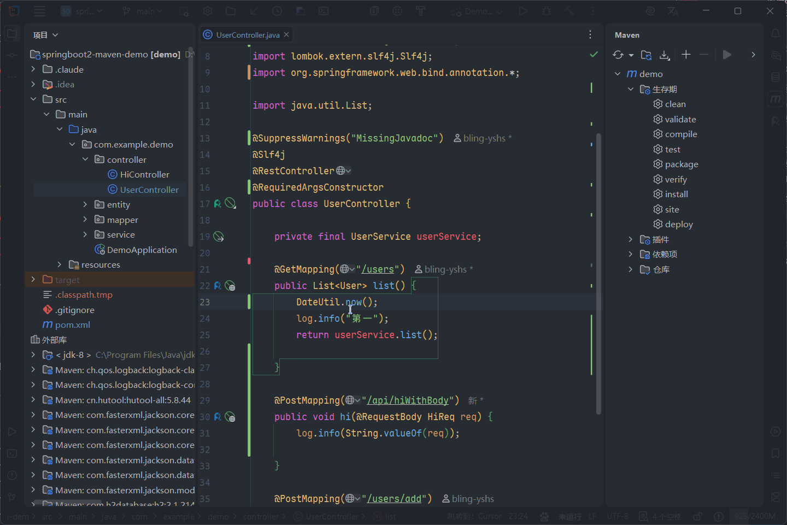

<h1 align="center">📦 Jar Source Reader</h1>

<p align="center">
  <strong>AI Skill · 让 AI 直接阅读 jar 依赖源码 · Maven / Gradle 双支持</strong>
</p>

<br>

<div align="center">
  <a href="https://github.com/bling-yshs/jar-source-reader/stargazers"></a>
  <a href="https://github.com/bling-yshs/jar-source-reader/releases/latest"></a>
  <a href="https://github.com/bling-yshs/jar-source-reader/blob/main/LICENSE"></a>
</div>
<br>

## ✨ 项目简介

本项目是一个 **Skill**。当 AI 需要查看 Maven / Gradle 项目中某个依赖 jar 包的源码，它可以通过此 Skill 直接读取并展示目标类、内部类或指定方法的 Java 源代码，无需你手动去翻阅源码。

### 💡 它解决了什么问题？

在日常开发中，AI 无法直接访问 jar 包内的源码。当你请求 AI 分析某个第三方库的实现细节时，AI 只能依赖训练数据中的记忆，可能不准确或已过时。本 Skill 让 AI 能够实时从你本地仓库中读取真实源码，给出更精确的分析。

## 🚀 功能特性

- 🔍 **类源码查看** — 支持传入类名或完全限定类名，直接输出目标类的完整源码
- 🪆 **内部类支持** — 使用 `$` 分隔符可查看嵌套内部类，如 `OuterClass$InnerClass`
- 🎯 **方法级查看** — 精确输出指定方法源码，支持重载方法一并展示
- 📐 **智能骨架降级** — 当类源码超过 500 行时，自动输出类结构摘要（字段 + 公开方法签名），引导 AI 进一步精确查询
- 📁 **双仓库支持** — 同时搜索 Maven（`~/.m2/repository`）和 Gradle（`~/.gradle/caches`）本地仓库
- 🛠️ **自定义仓库路径** — 支持通过参数显式指定仓库根目录

## 🔬 工作原理

本项目的核心思路其实非常简单：

1. **路径拼接** — 无论是 Maven 还是 Gradle 项目，依赖的 jar 包在本地磁盘上都有**固定的存储路径**（Maven 在 `~/.m2/repository`，Gradle 在 `~/.gradle/caches`）。只要知道目标依赖的 `groupId`、`artifactId` 和 `version`，就可以拼接出完整的本地路径，进而找到对应的 `*-sources.jar` 文件。
2. **ZIP 结构定位** — `sources.jar` 本质上是一个 ZIP 压缩包，而 Java 类的**全限定类名**天然对应 ZIP 内的文件目录结构（例如 `cn.hutool.core.util.IdUtil` → `cn/hutool/core/util/IdUtil.java`）。因此，通过全类名即可精确定位到源码文件在 ZIP 中的位置并读取其内容。
3. **AST 解析** — 读取到源码文本后，利用 JavaParser 将其解析为 AST（抽象语法树），从而支持按方法名精确提取、类结构摘要等高级功能。

整个过程不依赖 IDE，不需要网络访问，完全基于本地文件系统操作，因此速度很快。

## 🚧 当前困境与待解决问题

> **核心痛点：用户必须手动提供目标方法所在 jar 包的依赖坐标（groupId / artifactId / version），而这个信息目前无法由工具自动获取。**

目前，当 AI 想要查看某个第三方类的源码时，它需要先知道该类属于哪个 jar 包。但在实际使用场景中，AI 往往只知道类名（比如 `IdUtil`），而不清楚它来自哪个依赖。这使得使用体验存在明显的摩擦——用户需要自己去 `pom.xml` 或 `build.gradle` 中查找依赖信息，然后手动告诉 AI。

### 💭 目前的思路

我目前考虑的一个方向是：**利用 Maven / Gradle 的原生能力，遍历当前项目的所有依赖 jar 包，从中查找目标 Class 文件，再反推出其对应的依赖坐标。** 具体流程如下：

1. 获取当前项目所有依赖的 jar 包列表
2. 逐个扫描每个 jar 包，查找是否包含目标 Class 文件
3. 找到后，根据 jar 包的路径反推出 `groupId`、`artifactId`、`version`
4. 最终拼接出 `sources.jar` 的路径并读取源码

### ⚠️ 这个方案的瓶颈

| 构建工具 | 获取依赖列表的难度 | 说明 |
|:---:|:---:|:---|
| **Maven** | 🟢 相对容易 | 可以通过 `mvn dependency:build-classpath` 等原生命令直接获取 |
| **Gradle** | 🔴 较为困难 | 需要编写并注入一个自定义 Gradle 脚本来执行，而这又需要知道项目的根目录位置；此外 Gradle 启动守护进程（Daemon）本身就比较耗时，执行脚本也有额外的性能开销，整体速度不够理想 |

### 🙏 期待社区的力量

如果你有更好的方案来实现 **"根据类名自动定位其所属 jar 包"** 这一功能，非常欢迎提交 PR 或在 Issue 中讨论！

## 📖 安装与使用

### 1️⃣ 下载 Skill

从 [Releases](https://github.com/bling-yshs/jar-source-reader/releases/latest) 页面下载最新版本的压缩包。

### 2️⃣ 放置到 Skills 目录

将下载的文件解压后，放置到以下目录：

```
~/.claude/skills/jar-source-reader/
├── SKILL.md                            # AI Skill 描述文件
└── tool/
    └── jar-source-reader-all.jar    # 工具本体
```

### 3️⃣ 下载源代码（Source Jar）

在使用前，你需要确保目标依赖的 **sources jar** 已下载到本地仓库。

在 IntelliJ IDEA 中，打开 Maven 工具栏，点击 **「下载源代码」** 按钮即可：

<div align="center">
  
</div>

### 4️⃣ 向 AI 提供目标源码信息

在与 AI 对话时，你需要向 AI 提供你想查看的目标类所在 jar 包的依赖坐标信息（groupId、artifactId、version），AI 就会自动调用此 Skill 读取源码。

<div align="center">
  
</div>

## ⚙️ 参数说明

以下参数由 AI 在调用时自动填充，供开发者参考：

| 参数 | 必填 | 说明 |
|:---|:---:|:---|
| `--group-id` | ✅ | Maven Group ID，如 `cn.hutool` |
| `--artifact-id` | ✅ | Maven Artifact ID，如 `hutool-all` |
| `--version` | ✅ | 依赖版本号，如 `5.8.36` |
| `--class-name` | ✅ | 类名或完全限定类名，如 `IdUtil` 或 `cn.hutool.core.util.IdUtil`；内部类使用 `$` 分隔 |
| `--method-name` | ❌ | 方法名，传入后只输出对应方法源码；存在重载时会一并输出 |
| `--maven-repo` | ❌ | 指定 Maven 仓库根目录，默认 `~/.m2/repository` |
| `--gradle-repo` | ❌ | 指定 Gradle 仓库根目录，默认 `~/.gradle/caches/modules-2/files-2.1` |
| `--ignore-length-limit` | ❌ | 忽略 500 行的源码长度限制，强制输出完整源码 |

## 📂 项目结构

```
jar-source-reader/
├── src/
│   ├── main/kotlin/com/yshs/jsr/
│   │   └── Main.kt                # 🚀 程序入口与核心逻辑
│   └── test/                       # 🧪 单元测试
├── SKILL.md                        # 🤖 AI Skill 描述文件
└── build.gradle.kts                # 🔨 Gradle 构建配置
```

## 🛠️ 开发环境

| 环境 | 版本要求 |
|:---:|:---:|
| ☕ JDK | 8+ |
| 🐘 Gradle | Wrapper 自带 |

## 🔗 技术栈

| 依赖 | 用途 |
|:---|:---|
| [JavaParser](https://github.com/javaparser/javaparser) | 解析 Java 源码 AST，提取类/方法/字段声明 |
| [Clikt](https://github.com/ajalt/clikt) | Kotlin 命令行参数解析框架 |
| [Shadow](https://github.com/GradleUp/shadow) | 构建 fat jar（包含所有依赖） |

## 📄 许可证

本项目采用 [GPL-3.0](LICENSE) 开源许可证。
